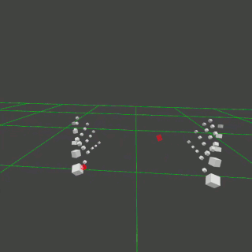

# Threejs-VR-Hand-Input-Physics (obsolete)

Explore physics simulations with Threejs VR hand input

[https://physicslibrary.github.io/Threejs-VR-Hand-Input-Physics/](https://physicslibrary.github.io/Threejs-VR-Hand-Input-Physics/)

## System Requirements

Oculus Quest 

Oculus Browser >14.3 (Quest update >25.0 and threejs r126). 

"chrome://flags/#webxr" in Oculus Browser. 
(WebXR hand and joints tracking experimental!) 
"WebXR experiences with hand and joints tracking" enabled. 

## 1. Minimal Threejs VR Hand Input

Open Oculus Browser to link and "Enter VR" with index finger-thumb click. To exit VR, use Oculus right hand gesture of facing palm with index finger and thumb touching. (Using controllers not recommended, not auto switching between controllers and hands, and dark scene. Experimenting.) 

[https://physicslibrary.github.io/Threejs-VR-Hand-Input-Physics/examples/threejs_vr_hand_input_physics.html](https://physicslibrary.github.io/Threejs-VR-Hand-Input-Physics/examples/threejs_vr_hand_input_physics.html)

(February 20, 2021. 
Oculus Quest (version>25) and WebXR (https://www.w3.org/TR/webxr-hand-input-1/) updates. 
"line trail[i].position.x = hand2.joints[XRHand.INDEX_PHALANX_TIP].position.x" not working and is commented out so no black screen and just display hands' joints. 
Experimenting with codes to see what is working.) 

Threejs-VR-Hand-Input-Physics use a subset of three.js r126 to start VR with hand and joints tracking. Since it is experimental, it will probably break in future update of browser or threejs. Fantastic that Oculus browser has WebXR hand and joints tracking and three.js makes it accessible. 

This example is not about physics except some kinematics. The right index finger plots 100 3D ticks. Assuming Oculus Quest 72Hz framerate (don't know sampling rate of joints tracking or time to determine joints' positions), time between each tick is ~13.9ms. The distance between two consecutive ticks is the distance the index finger moves in ~13.9ms. In the animated gif above, ticks are close together when finger accelerates (+/-) at peaks of sine wave and further apart between peaks.

The .html codes in Threejs-VR-Hand-Input-Physics are developed on a Raspberry Pi 3 Model B+ and tested with Oculus Quest. There is a short tutorial on writing three.js codes on a Raspberry Pi in "Making Threejs-WebXR-67P":

[https://github.com/Physicslibrary/Threejs-WebXR-67P](https://github.com/Physicslibrary/Threejs-WebXR-67P)

## 2. Threejs VR Hand Input Palm-Up Gesture (stopped working)

An example of left palm-up to make a box visible (open a menus or change variables). The y-positions of two red cubes are used to compute a number when the palm is facing up.

## References

July 29, 2020 Threejs r119 added experimental Hand Input API support. 

https://github.com/mrdoob/three.js/releases/tag/r119

Threejs VR hand input examples "vr / handinput" work in Oculus Browser: 

https://threejs.org/examples/

Threejs webxr_vr_handinput*.html codes to learn:

https://github.com/mrdoob/three.js/tree/dev/examples

