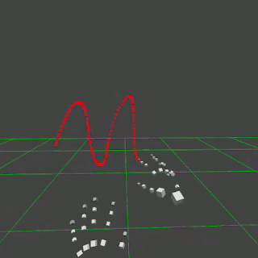

# Threejs-VR-Hand-Input-Physics

Explore physics simulations with Threejs VR hand input

[https://physicslibrary.github.io/Threejs-VR-Hand-Input-Physics/](https://physicslibrary.github.io/Threejs-VR-Hand-Input-Physics/)

## System Requirements

Oculus Quest. 

Oculus Browser >10.2 (Quest update >19.0 and threejs r119). 

"chrome://flags/#webxr" in Oculus Browser. 
"WebXR experiences with joints tracking" enabled. 
"WebXR experiences with hands tracking" disabled. 

## 1. Minimal Threejs VR Hand Input

With an Oculus Quest, open Oculus Browser to link (and "Enter VR" with controller): 

[https://physicslibrary.github.io/Threejs-VR-Hand-Input-Physics/examples/threejs_vr_hand_input_physics.html](https://physicslibrary.github.io/Threejs-VR-Hand-Input-Physics/examples/threejs_vr_hand_input_physics.html)

To exit simulation, use Oculus Quest right hand gesture of facing palm with index finger and thumb touching (or press left Touch controller menu button). 

Files (except .html) in /build and /examples are from threejs r119. These are minimal files to start VR with joints tracking. Since it is experimental, it may break in future update of browser or threejs. Also, a controller is needed to "Enter VR". Nevertheless, it is fantastic that Oculus has WebXR joints tracking in its browser and three.js in its library. 

For this example, there isn't any physics except some kinematics. The right index finger plots 100 3D ticks. Assuming Oculus Quest 72Hz framerate (don't know sampling rate of joints tracking or time to determine joints' positions), time between each tick is ~13.9ms. The distance between two consecutive ticks is the distance the index finger moves in ~13.9ms. In the animated gif above, ticks are close together when finger accelerates (+/-) at peaks of sine wave and further apart between peaks.

All .html codes in Threejs-VR-Hand-Input-Physics are developed on a Raspberry Pi 3 Model B+ and tested with Oculus Quest. There is a short tutorial on writing three.js codes on a Raspberry Pi in "Making Threejs-WebXR-67P":

[https://github.com/Physicslibrary/Threejs-WebXR-67P](https://github.com/Physicslibrary/Threejs-WebXR-67P)

## References

July 29, 2020 Threejs r119 added experimental Hand Input API support. 

https://github.com/mrdoob/three.js/releases/tag/r119

Oculus Browser >10.2 "chrome://flags" must be changed. 

https://github.com/marlon360/webxr-handtracking

Threejs VR hand input examples "vr / handinput" work in Oculus Browser: 

https://threejs.org/examples/

Threejs webxr_vr_handinput*.html codes to learn:

https://github.com/mrdoob/three.js/tree/dev/examples

July 23, 2020 Oculus added experimental WebXR Hand Input in Oculus Browser >10.2. 

https://twitter.com/fernandojsg/status/1286381837301022721

